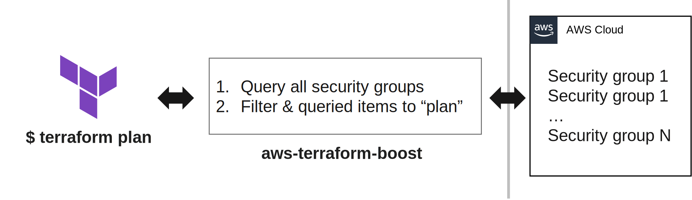

# aws-terraform-boost

> _WARNING: This is an alpha software; use it very carefully!_

This project introduces a HTTPS proxy written in Go. It acts as an intermediary between Terraform and AWS, designed to significantly improve state retrieval speed. The proxy queries and caches all entries in the specified category from AWS at once, followed by locally serving the specific entries requested by `terraform plan`.

Since there is no cache invalidation at this moment, this proxy should be turned on right before `terraform plan`, and restarted after applying the terraform rules.



## Supported caches

- SecurityGroupRules

## How to run

```sh
# writes self-signed certificates into ./certs/*
./generate-certificate.sh

go run cmd/proxy/main.go -aws-profile [profile]
# or
go run cmd/proxy/main.go -aws-profile [profile] --credentials-file ~/.aws/credentials
```

## How to use the proxy in Terraform

```sh
SSL_CERT_FILE=[aws-terraform-boost]/certs/ca.pem HTTPS_PROXY=127.0.0.1:10001 terraform plan
```
